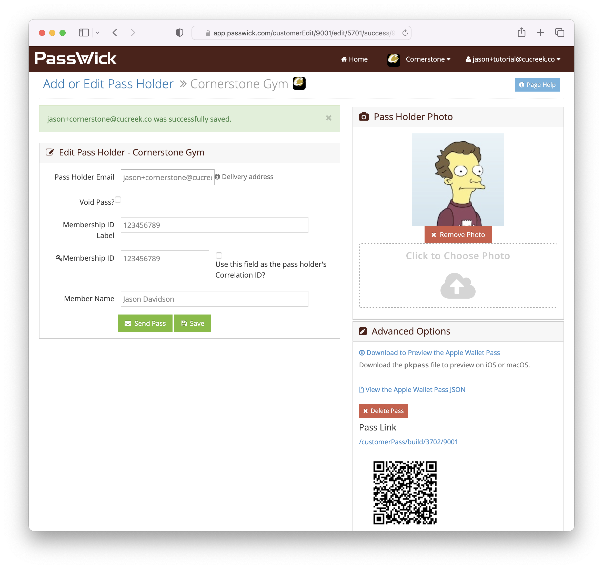

# Introduction

Welcome to the PassWick user guides! These guides are intended for pass designers and technicians who will be integrating
their systems with PassWick to create and deliver Apple Wallet passes to their customers.

## PassWick Concepts

Let's start with a few PassWick concepts:

**Organization** is you or your business. Organizations have **Customers** that can be business customers, employees, students, etc.

**Customer** is the person that holds your **Organization's** **Pass** in their **Apple Wallet**.

**Template Pass** is the design of a pass used at your **Organization**. Customer **Passes** are created from this template using the customer's data.

**Pass** is a digital representation of a thing like a coupon, event ticket, airline ticket, certification, license, gym pass, etc. that is stored in the customer's wallet.

**Apple Wallet** is a built-in app on iPhoneOS.  **Customers** store their **Passes** in the **Apple Wallet**.

**PassWick** is the cloud service your **Organization** can use to quickly distribute **Passes** to your **Customer's** **Apple Wallet**.

The relationship is best expressed in the following diagram:

1. The **Organization** uses the PassWick console Pass Designer to design a **Template Pass**. The template pass contains the icons, colors, labels, and custom data fields that will be displayed in the Apple Wallet Pass.
2. The **Organization** uploads their customer list to PassWick using the API, CSV upload, or console.
3. The **Customer** data fields are merged with the **Template Pass** automatically by PassWick and a customized **Pass** containing the customer data is created.
4. The customized customer **Pass** is distributed to the **Customer** using e-mail, a hyperlink, or a QR code - all created for the **Organization** by PassWick.
5. The **Customer** receives the **Pass** and adds it to their **Apple Wallet**.
With that out of the way, let's get started.

## Getting Started

First, [contact us](https://passwick.com/#contact) to get your **Organization** set up. We offer limited beta accounts free of charge.

We will set up [a beta account](https://passwick.com/#contact) for your organization with access to [the PassWick console](https://app.passwick.com).

When you're ready to use PassWick in production, we'll work with you to set up billing and invoicing.

The following sections demonstrate how easy it is to build a custom pass and distribute it to your customers.

## Ultimate Quick Start: How to Send Passes to Customers

### Generate a Template Pass

Recall that a **Template Pass** is the design of a pass used at your Organization. We'll be designing our **Template Pass** in this section.

With your PassWick account, you can [log on to the admin console](https://app.passwick.com/login):

#### Log In to the PassWick Console

#### Copy a Global Template Pass

After you have logged in, the easiest way to quickly create a **Template Pass** is to start your **Template Pass** design from a curated list of global templates.

From the Home page click the `Create a New Pass Design` button. The template gallery will be displayed:

For this tutorial, we'll be creating a **Membership Card** style pass.  Click the `Select` button to select the `Gym Membership` pass as our template.

#### Edit Your Pass Template

Now we can change the name of our **Template Pass**. Let's call our gym (**Organization**) _Cornerstone_.

Click the `Save` button to save our changes.

Let's leave the rest of the pass settings alone for now. But notice PassWick provides several options for pass customizations including:
- Color, label, and field layout
- Logo and icon set up
- Front of card and back of card field settings
- Barcode configuration
- Context aware relevance
- And more!

> What is `{data}`? Great question! This is the cornerstone of PassWick template passes: the ability to design a pass at the Organizational level and fill in the `{data}` fields for each of your **Customers!** Our `Cornerstone` template pass allows us to send membership passes to our **Customers** with their name on the front of the pass. Read on for more info!

Notice that after we clicked `Save` our _Cornerstone_ gym membership shows a persons silhouette - that's because we can put a picture of our **Customer** on their passes for them! Read on, it's cool.

[Saved Pass](img/SavedPass.png)

### Sending the Pass to Customers

Now that we have our **Template Pass** defined we need to deliver it to our customers.

There a couple of ways to do this in PassWick:
* Upload a CSV file containing a list of our customers
* Use the [PassWick API](./api)
* Use the PassWick console to manually add a customer.

For this demo, we'll be using the console.

### Adding a Customer Pass Via the Console

First, let's get back to the `Home Page`:

Next, click the `Add Pass Holder` link to navigate to the pass holder administration page.

#### Add or Edit Pass Holder

There's a lot going on on this page. For this tutorial, let's focus on our **Customer's** e-mail, membership ID, name, and photo.

Here's the important fields:

|Field|Description|
|-|-|
|Pass Holder Email|Everyone one of our **Customers** must have a unique e-mail address per pass.|
|Membership ID|This value comes from our template pass. We could have named it anything on our **Template Pass**. This is a `{data}` customized field.|
|Membership ID Label|This value is displayed under our barcode. Note that for our **Template Pass** the member ID is encoded in the barcode. This allows our gym to scan the member id when the **Customer** checks in, for example|
|Member Name|Again, another `{data}` customization on our **Template Pass*.|

Next, the `Pass Holder Photo` section allows us to upload an image for our **Customer's** pass.

So let's fill everything in and press `Save`:

Success! We have created a pass for our **Customer**. Next, we need to deliver this pass.

Again, there are multiple options here:
* Press the `Send Pass` button to e-mail the pass to the **Customer.**
* Copy the `Download to Preview the Apple Wallet Pass` link and share it with the **Customer.**
* Copy the QR code and share that with the **Customer.** When the customer scans it on their iPhone it will be installed into the wallet.

Let's just press `Send Pass` to e-mail the pass to our customer.

When the **Customer** checks their e-mail on their iPhone they'll see a message from Passwick:

Then, when they click the pass it will add to their wallet:

That's it! We just created an Apple Wallet pass for our Cornerstone gym!

## Using the PassWick API

Click the [API](/api) menu option to [view the API guide](/api).

You can visit the [live APIs here](https://app.passwick.com/api/swagger-ui.html#/). 

## License and Agreeement

Please be sure to [read our terms of service](https://app.passwick.com/legal/termsofservice.txt).

PassWick is licensed under the [Apache License, Version 2.0](https://www.apache.org/licenses/LICENSE-2.0)
